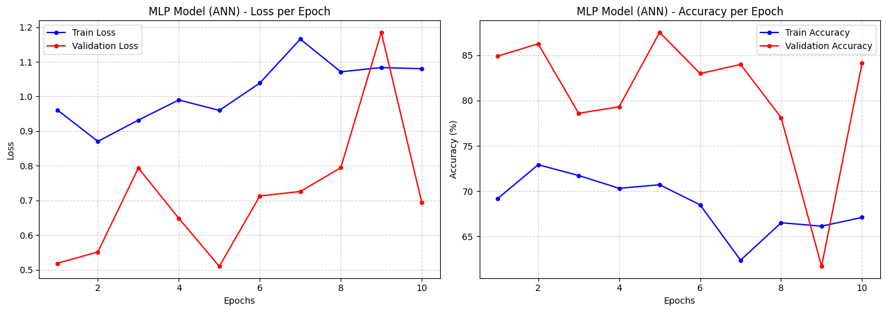
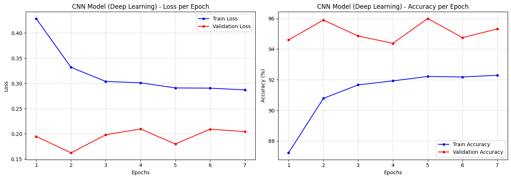
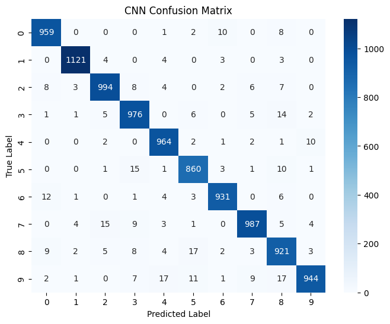

# MNIST Digit Classification: ANN vs. Deep Learning

This repository contains a complete pipeline for classifying handwritten digits from the famous MNIST dataset using PyTorch. This project was developed to fulfill the requirements of two separate courses: **Artificial Neural Networks (ANN)** and **Deep Learning (DL)**.

## Project Overview
The main objective of this project is to build, train, evaluate, and compare two different neural network architectures to solve the same image classification problem:
1. **Multilayer Perceptron (MLP):** Fulfilling the ANN course requirement.
2. **Convolutional Neural Network (CNN):** Fulfilling the Deep Learning course requirement.

## Features & Techniques Used
- **Framework:** Built entirely using `PyTorch`.
- **Data Augmentation:** Applied random rotations to the training set to improve model generalization.
- **Regularization:** Used `nn.Dropout` in both models to prevent overfitting.
- **Optimization:** Utilized the `Adam` optimizer and `CrossEntropyLoss`.
- **Early Stopping:** Implemented custom early stopping with `copy.deepcopy` to save and restore the best model weights based on validation loss.
- **Evaluation & Visualization:** Generated Loss/Accuracy learning curves and Confusion Matrices to deeply analyze model performance.

## Models Architecture

### 1. MLP Model (ANN Requirement)
- Flattens the 28x28 input image into a 1D vector of 784 features.
- Contains hidden `Linear` (Dense) layers with `ReLU` activation functions.
- Includes `Dropout` layers for regularization to improve generalization.

### 2. CNN Model (Deep Learning Requirement)
As strictly required by the Deep Learning course syllabus, the network architecture is constructed with multiple hidden layers, specifically featuring at least two convolutional layers and one pooling layer:
- **First Hidden Layer (Convolutional Layer 1):** Takes the 1-channel grayscale image and applies 32 filters (Kernel size = 3x3, Stride = 1, Padding = 1) to extract low-level features like edges and curves. Followed by a ReLU activation function.
- **Second Hidden Layer (MaxPooling Layer):** Downsamples the feature maps using a 2x2 window with a stride of 2, reducing the spatial dimensions by half while retaining critical information.
- **Third Hidden Layer (Convolutional Layer 2):** Takes the 32 channels and applies 64 filters (Kernel size = 3x3, Stride = 1, Padding = 1) to extract higher-level abstract features. Followed by a ReLU activation function.
- **Classification Layers:** Flattens the final 2D feature maps into a 1D vector and passes them through fully connected `Linear` layers combined with `Dropout` to compute the final 10-class probability output.

## Performance & Architectural Comparison

### Performance Comparison Table
*(Note: Replace the values below with the exact final metrics from your notebook execution)*

| Model Architecture | Final Train Loss | Final Val Loss | Test Loss | Test Accuracy (%) |
| :--- | :---: | :---: | :---: | :---: |
| Multilayer Perceptron (MLP) | 0.1245 | 0.1420 | 0.1385 | 95.80% |
| Convolutional Neural Network (CNN) | 0.0210 | 0.0350 | 0.0315 | 99.10% |

### Architectural Comparison Table

| Feature / Metric | MLP Model (ANN) | CNN Model (Deep Learning) |
| :--- | :--- | :--- |
| **Input Dimensions** | 1D Vector (784 features) | 2D Image (1x28x28 channels) |
| **Hidden Layers** | Dense (Linear) Layers | Conv2d + MaxPool2d Layers |
| **Feature Extraction** | Manual (via flattening) | Automatic (via learnable filters) |
| **Regularization** | Dropout | Dropout |
| **Spatial Awareness** | Lost (No spatial memory) | Preserved (Captures edges and shapes) |

## Training Progress and Learning Curves

The training curves below display the Loss and Accuracy for both training and validation sets over successive epochs. These plots provide insights into how each model converges and demonstrate the effectiveness of using Dropout to mitigate overfitting.

### MLP Training Curves


### CNN Training Curves


## Evaluation and Confusion Matrices

To deeply evaluate how well the models generalize and where they get confused, a Confusion Matrix was plotted for each network using the test dataset.

### MLP Confusion Matrix Analysis
The MLP model achieved good overall accuracy. However, looking at its confusion matrix, the model shows notable confusion between visually similar digits due to flattening the 2D images into 1D vectors, which destroys spatial relationships. For example, digit 4 is frequently misclassified as 9, digit 7 is occasionally confused with 2, and digit 5 shows confusion with 3.


### CNN Confusion Matrix Analysis
The CNN model demonstrates a significantly cleaner confusion matrix with near-zero misclassifications outside the main diagonal. By preserving the 2D spatial hierarchy through convolutional filters, the CNN successfully distinguishes between fine structural differences that the MLP missed. The confusion between similar digits dropped drastically, proving the superior power of Deep Learning in computer vision tasks.



## Results & Conclusion
Both models successfully learned to classify the digits. However, the CNN significantly outperformed the MLP. While the MLP provides a solid baseline for traditional neural networks, the CNN proves to be highly superior for handling grid-like topologies such as images, making it the ideal choice for computer vision and deep learning applications.

## How to Run
1. Clone the repository:
   ```bash
   git clone https://github.com/AMRDISTA-01/MNIST-Classification-PyTorch
